# 基于springboot框架开发的景区民宿预约系统

#### 介绍

随着旅游业的蓬勃发展，景区民宿成为了游客们喜爱的住宿选择。为了满足游客便捷预订民宿以及景区管理的需求，我们开发了这个基于 Spring Boot 框架的景区民宿预约系统。该系统旨在提供一个高效、便捷、智能的平台，实现景区民宿资源的优化配置和管理，提升游客的旅游体验。

#### 技术栈

后端技术栈：Springboot+Mysql+Maven

前端技术栈：Vue+Html+Css+Javascript+ElementUI

开发工具：Idea+Vscode+Navicate

#### 系统功能介绍

（一）管理端  
个人中心：管理端用户可以在个人中心查看和修改个人信息，接收系统重要通知和消息。  
管理员管理：对不同级别的管理员进行添加、删除、修改权限等操作，确保管理团队的合理分工和有效运作。  
基础数据管理：维护系统所需的基础数据，如民宿类型、房间设施分类、价格区间等，为系统的正常运行提供数据支持。  
房间信息管理：全面管理民宿房间的信息，包括房间的类型、数量、价格、图片、设施描述等，以便游客能够准确了解房间详情。  
工作人员管理：对景区民宿的工作人员进行信息登记、岗位分配、工作考核等管理，保障工作人员的服务质量。  
工作记录管理：查看工作人员的工作记录，包括接待游客数量、服务评价、问题处理情况等，为绩效评估提供依据。  
景点信息管理：录入和更新景区的景点介绍、开放时间、门票价格等信息，方便游客规划行程。  
美食信息管理：收集和整理景区周边的美食店铺、特色菜品、推荐餐厅等信息，丰富游客的旅游体验。  
公告管理：发布重要通知、活动信息、优惠政策等公告，确保游客和工作人员及时获取最新消息。  
用户管理：对注册用户的信息进行审核、管理，了解用户的预订记录和偏好，为精准营销提供数据支持。  
轮播图信息管理：设置系统首页的轮播图，展示热门民宿、特色景点、优惠活动等吸引游客的重要信息。  

（二）工作人员端  
房间信息：查看民宿房间的详细信息，了解房间的预订情况和状态。  
景点信息：掌握景区景点的相关信息，为游客提供准确的景点介绍和游览建议。  
美食信息：熟悉景区周边的美食资源，能够向游客推荐合适的餐饮选择。  
公告：及时获取管理端发布的公告信息，了解工作安排和最新政策。  
个人中心：修改个人资料，查看工作任务和绩效评估结果。  
后台管理  
房间信息管理：协助管理端对房间信息进行更新和维护，如补充房间照片、修改房间描述等。  
工作记录管理：记录自己的日常工作情况，包括接待的游客信息、处理的问题等。  
景点信息管理：更新景点的实时信息，如景点的临时关闭、维修情况等。  
美食信息管理：发现新的美食店铺或菜品时，及时更新美食信息。  
公告管理：协助管理端发布和维护公告，确保信息的准确和及时传达。  

（三）用户端  
房间信息：浏览民宿房间的详细介绍、图片、价格等，根据自己的需求进行筛选和预订。  
景点信息：了解景区内各个景点的特色、开放时间和游玩攻略，合理安排游览行程。  
美食信息：查看景区周边的美食推荐，获取餐厅地址、菜品评价等信息，满足味蕾需求。  
公告：获取景区和民宿的最新通知、优惠活动等重要信息。  
个人中心：管理个人信息，查看预订记录、订单状态，进行订单的取消或修改等操作。  
后台管理  
房间信息管理：对自己预订的房间进行管理，如查看预订详情、申请退订等。  
工作记录管理：记录与民宿和景区相关的个人体验和反馈。  
景点信息管理：收藏感兴趣的景点，查看自己的景点游览记录和评价。  
美食信息管理：标记喜欢的美食，分享美食体验和评价。  
公告管理：关注重要公告，确保不错过与自己行程相关的信息。  

#### 系统作用

景区民宿预约系统的主要作用包括：  
 
提升管理效率： 提供全面的管理工具，帮助管理员高效地管理景区民宿的各类资源和信息，确保系统的正常运营。  
优化服务流程： 工作人员可以方便地查看和管理房间信息、景点信息、美食信息等，提升工作效率和服务质量。  
便捷用户体验： 用户可以轻松地浏览和预订房间，查看景点和美食信息，获取最新公告，提升整体用户体验。  
促进信息交流： 通过公告和管理模块，实现系统内外的信息共享和交流，增强各角色之间的协作和沟通。  

#### 系统功能截图

代码结构

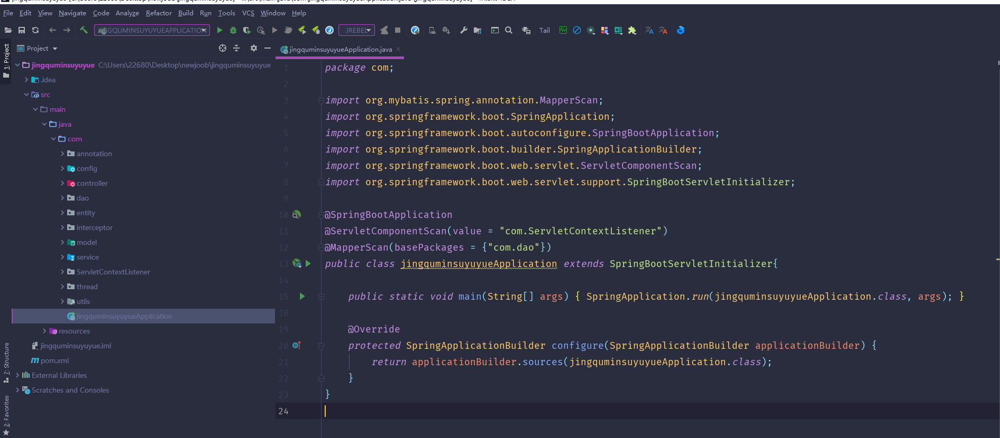

数据库表

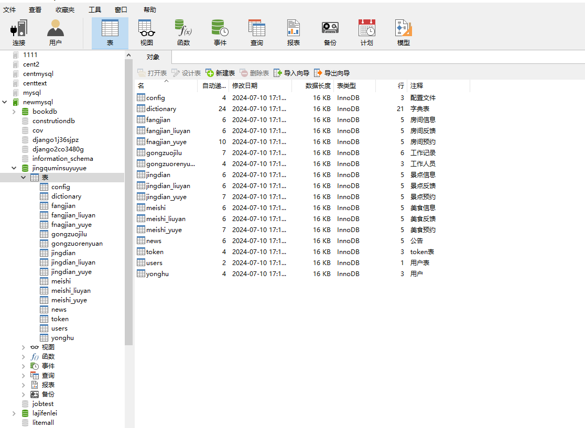

登录

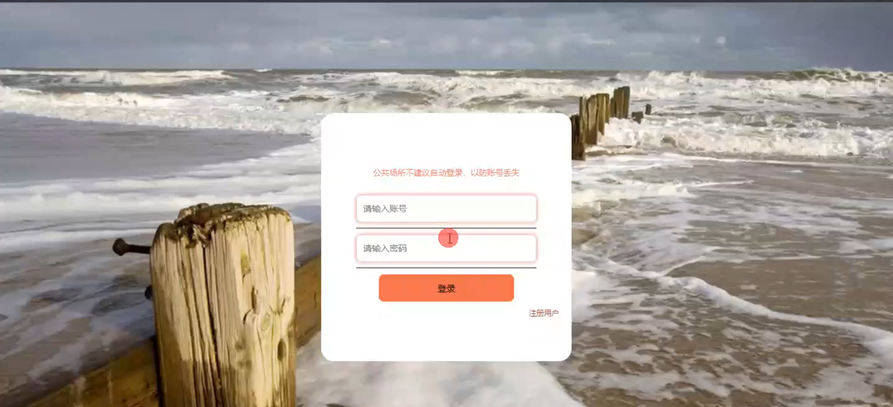

前台页面首页

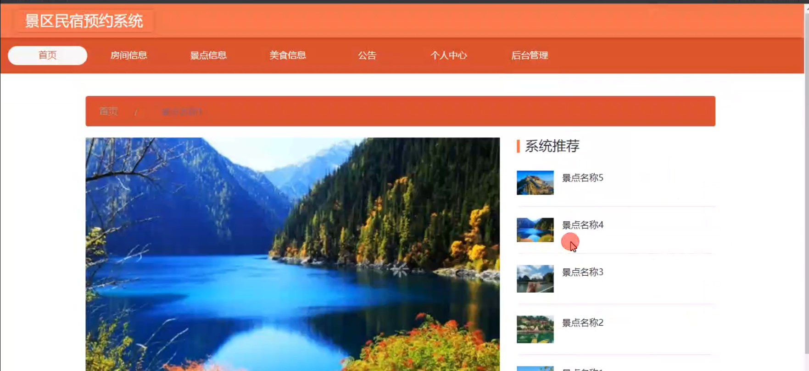

房间信息

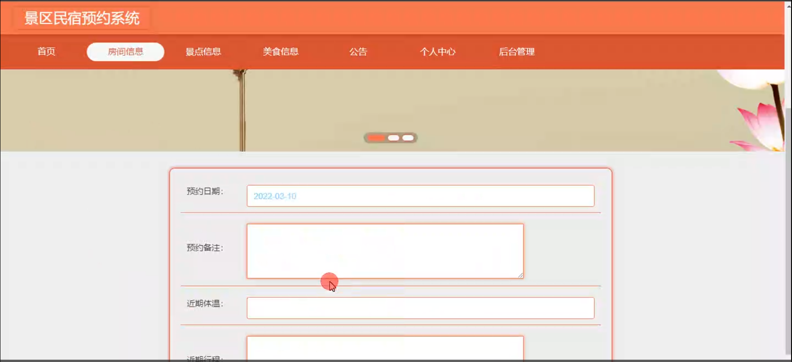

美食信息

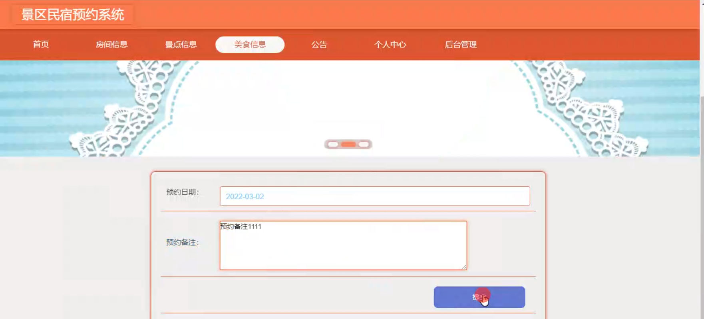

公告

管理员端管理信息

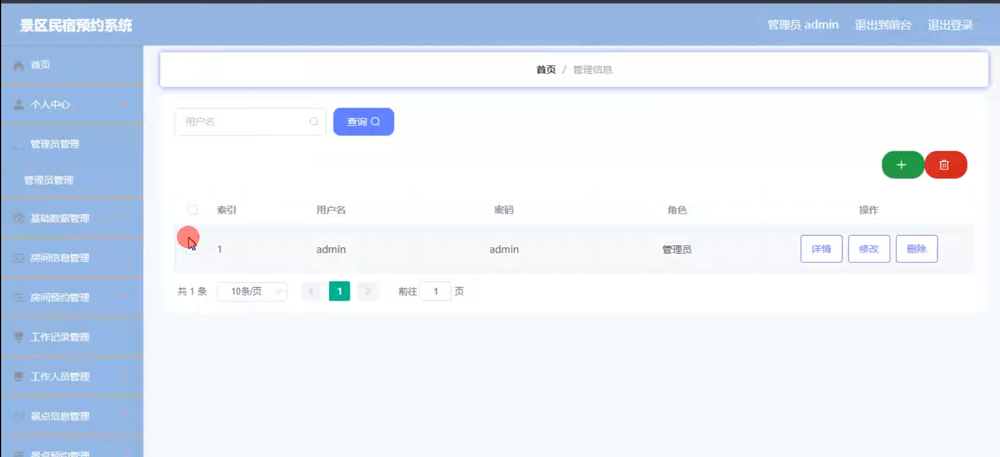

工作记录管理

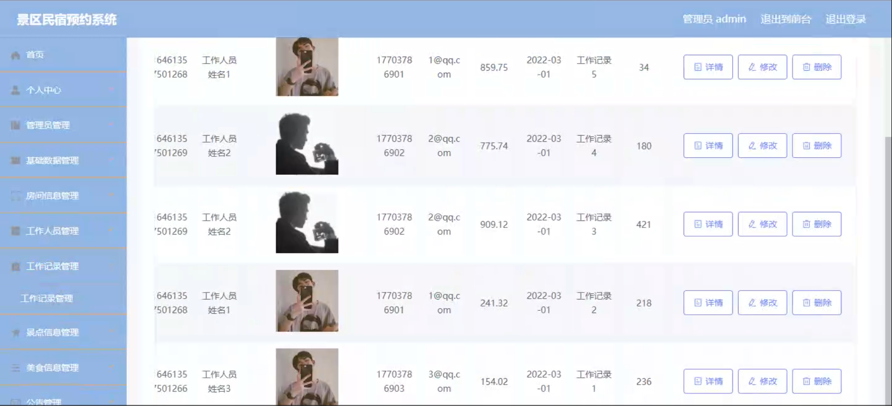

景点预约管理

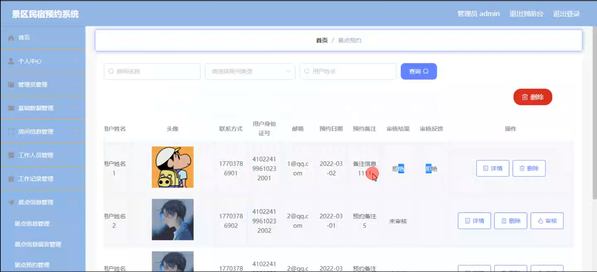

轮播图信息管理

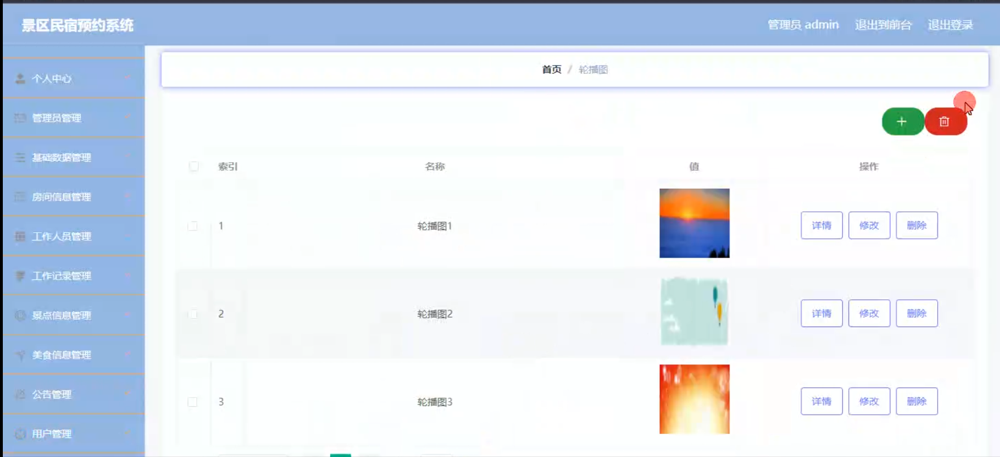

工作人员端房间信息管理

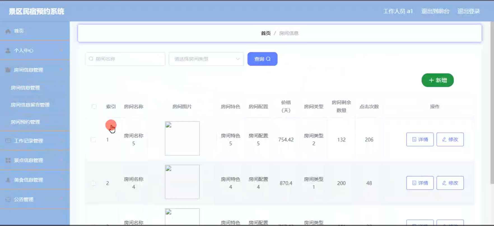

工作记录管理

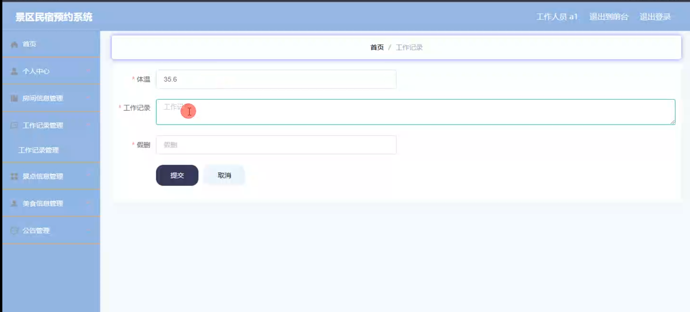

用户端后台管理

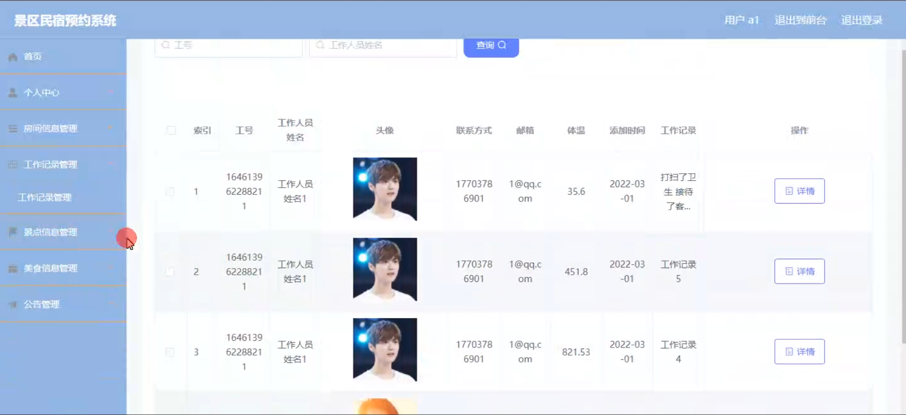

#### 总结

基于 Spring Boot 框架开发的景区民宿预约系统，通过清晰的角色划分和全面的功能模块，实现了景区民宿资源的高效管理和游客服务的优化。管理端能够统筹全局，工作人员端能够提供优质服务，用户端能够便捷预订和规划行程。该系统有助于提升景区民宿的竞争力和知名度，为旅游业的发展注入新的活力。

#### 使用说明

创建数据库，执行数据库脚本 修改jdbc数据库连接参数 下载安装maven依赖jar 启动idea中的springboot项目

前台登录页面
http://localhost:8080/jingquminsuyuyue/front/index.html

后台登录页面
http://localhost:8080/jingquminsuyuyue/admin/dist/index.html

管理员			账户:admin 	密码：admin
工作人员			账户:a1 		密码：123456
用户				账户:a1 		密码：123456